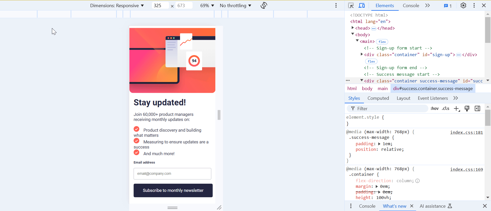

# Frontend Mentor - Newsletter sign-up form with success message solution

This is a solution to the [Newsletter sign-up form with success message challenge on Frontend Mentor](https://www.frontendmentor.io/challenges/newsletter-signup-form-with-success-message-3FC1AZbNrv).

## Table of contents

- [Overview](#overview)
  - [The challenge](#the-challenge)
  - [Screenshot](#screenshot)
  - [Links](#links)
- [My process](#my-process)
  - [Built with](#built-with)
  - [What I learned](#what-i-learned)
  - [Continued development](#continued-development)
  - [Useful resources](#useful-resources)
- [Author](#author)

**Note: Delete this note and update the table of contents based on what sections you keep.**

## Overview

### The challenge

Users should be able to:

- Add their email and submit the form
- See a success message with their email after successfully submitting the form
- See form validation messages if:
  - The field is left empty
  - The email address is not formatted correctly
- View the optimal layout for the interface depending on their device's screen size
- See hover and focus states for all interactive elements on the page

### Screenshot



### Links

- Solution URL: [Github link](https://your-solution-url.com)
- Live Site URL: [Newsletter sign-up form](https://your-live-site-url.com)

## My process

### Built with

- Semantic HTML5 markup
- CSS custom properties
- Flexbox
- Vanilla Javascript

### What I learned

I learned how to setup a basic `form`. I also learned how to add `label` for an `input` element using `for`:
```html
<form id="form" novalidate>
          <div class="label_text">
            <label for="email">Email address</label>
            <span id="error-msg">Valid email required</span>
          </div>
          <input type="email" id="email" name="email" placeholder="email@company.com">
          <button class="btn submit-btn" type="submit">Subscribe to monthly newsletter</button>
        </form>
```

I learned how to unset all the default css for an element:
```css
button {
    all:unset;
}
```

I learned how to use `linear-gradient`:
```css
.btn:hover {
    background-image: linear-gradient(to right, var(--tomato-pink), var(--tomato));
    transition: background-color 0.3s ease;
}
```

I learned how to use custom marker in `ul`:
```css
ul {
    list-style: none;
    padding-bottom: 1em;
}

ul li:before {
    content: url('./assets/images/icon-list.svg');
    margin-right: 1em;
}
```

I learned how to style a basic `input` element:
```css
input {
    border: 1px solid var(--grey);
    border-radius: 0.3em;
    margin-top: 1em;
    padding: 1em;
    width: 100%;
}
```

I learned how to fetch form data:
```js
const form = document.getElementById('form');
const handleSubmit = (e) => {
    e.preventDefault(e);
    const formData = new FormData(e.target);
    const data = Object.fromEntries(formData);
};
form.addEventListener('submit', handleSubmit);
```

I learned how to use regex:
```js
const validateEmail = (email) => {
    const emailRegex = /^[^\s@]+@[^\s@]+\.[^\s@]+$/;
    return email.match(emailRegex);
};
```

### Continued development

I still need to practice the positioning an element & `@media`. I need to practice using JS for making the UI to react to different events. I also need to learn about responsive CSS, HTML5 rules & JS do's & don'ts.

### Useful resources

- [SVG icon as bullets](https://brickslabs.com/how-to-add-svg-icon-as-list-item-bullets/) - This helped me in adding SVG icon in `ul`.
- [Regex for valid email](https://stackoverflow.com/questions/46155/how-can-i-validate-an-email-address-in-javascript) - I learned what regex to use to validate email.

## Author

- Frontend Mentor - [@snigdha-sukun](https://www.frontendmentor.io/profile/snigdha-sukun)
